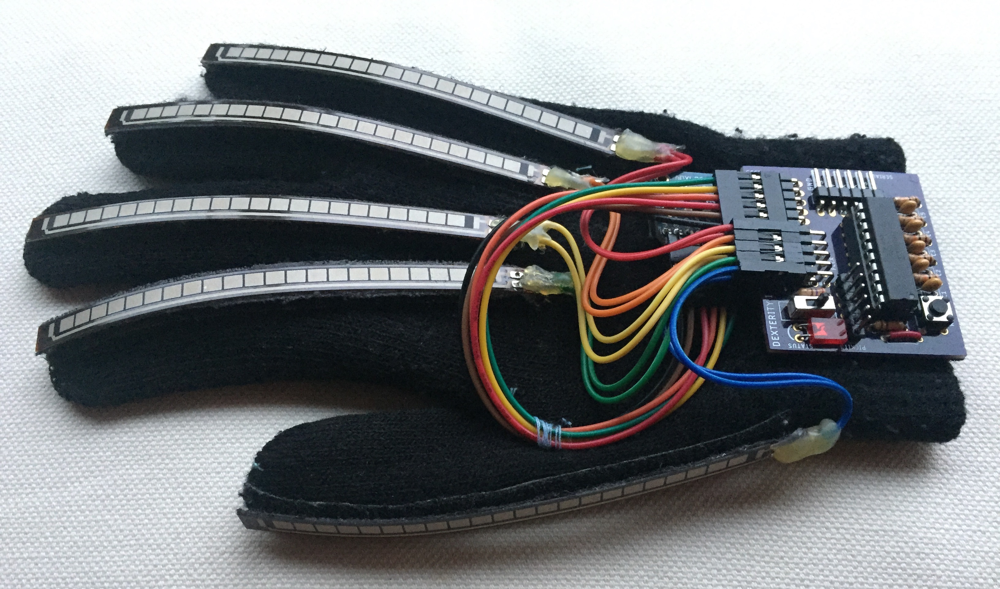
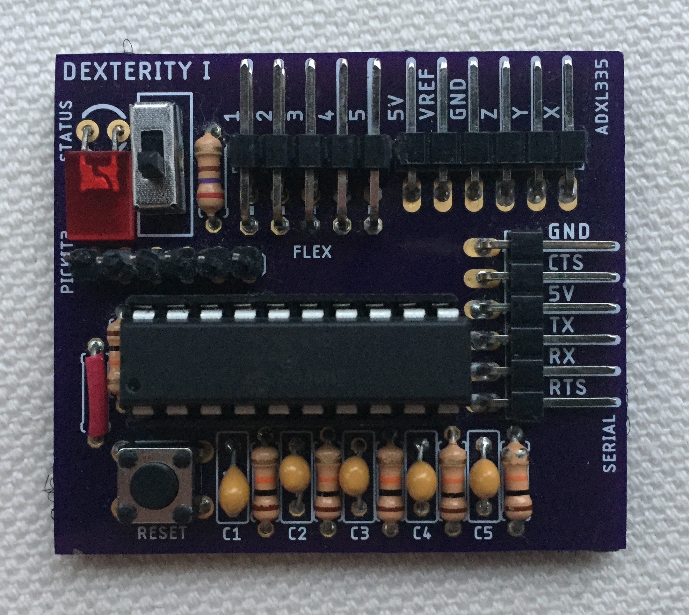
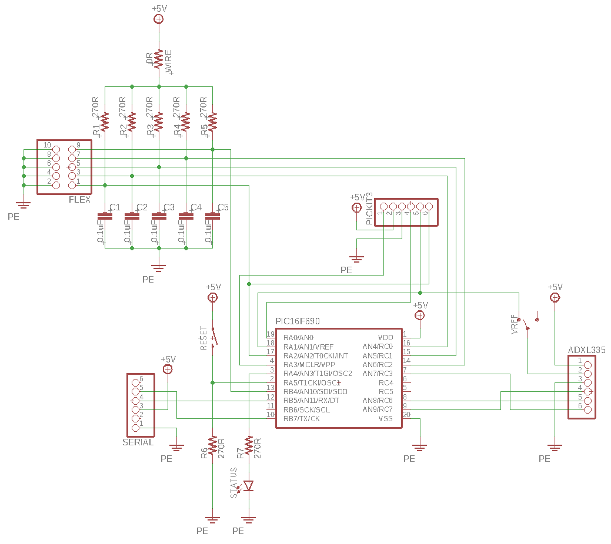
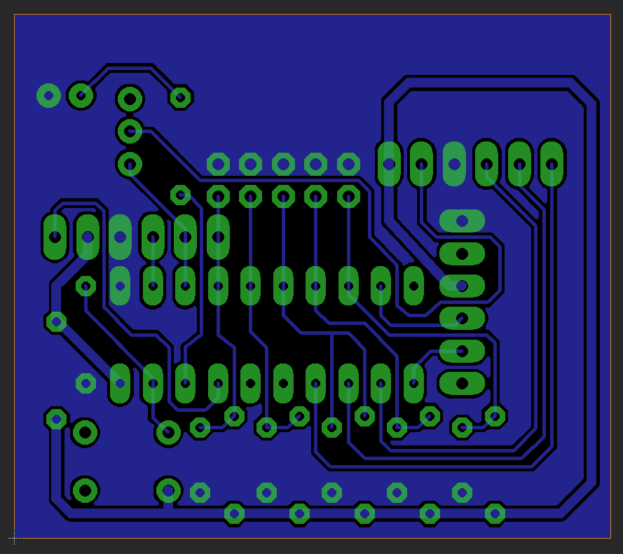

# Dexterity

Dexterity is a wearable gesture recognition device which uses custom hardware, firmware, and software to measure hand movement and finger position via an array of specialized sensors.  This data can be interpreted in real time to identify hand gestures and execute corresponding actions on a computer system.  Dexterity is designed to be a scalable and can be used as a peripheral for any electronic device.  This makes it suitable for a variety of applications involving gesture recognition.

A common approach towards gesture recognition is to use computer vision and machine learning in order to decipher gestures through a video feed.  This can be a computationally intensive task, depending on the complexity of the algorithms and the hardware capabilities, which in turn increases latency and decreases throughput.

Dexterity tackles this issue by placing sensors directly on a wearable glove.  The sensors are continuously sampled by an onboard microcontroller, which transmits the readings to a host PC via a high-speed serial UART connection.  The stronger hardware of the host can then be used to run interpretation algorithms on the raw readings.  This avoids placing unnecessary computational stress on a low power device while providing a more accurate model of the hand compared to computer vision.

## Hardware

Dexterity's hardware consists of a glove equipped with 8 sensors and a microcontroller.  Each finger has an attached flex sensor, which changes resistance when the finger bends.  This allows the position of each finger to be read accurately.  Additionally, a 3-axis analogue accelerometer is placed on the top of the glove, which can be used to determine the movement and orientation of the hand.



The device is powered by a custom circuit board with a Microchip PIC16F690 microcontroller.  This is an 8-bit low power computer that reads the flex sensors and accelerometer using its analogue-to-digital converter (ADC).



The board requires a wired serial connection, which doubles as the 5V power supply.  If a wireless serial transmitter is used in the future, then a separate battery will be needed to power the board.  The accelerometer is an ADXL335 3-axis sensor module, composed of analogue output pins for the X, Y, and Z spatial directions.  Resistors were added for the flex sensors to produce a voltage divider sampling node, and 0.1uF filtering capacitors were added for noise reduction.  The board also contains an enable/disable button and a status LED.



Autodesk EAGLE was used to complete schematic entry and board layout.  These files can be found under the `hardware` directory.



## Firmware

Custom firmware was developed to run on the PIC microcontroller.  This program runs forever as long as the board is powered.  The source code is located in the `firmware` directory.

The firmware reads the analogue voltages of each of the 8 sensors.  Each sensor is attached to an input pin, and the PIC will perform an ADC conversion on each of these analogue voltage inputs.  The microcontroller can also scale the readings between a certain range, which is useful for gesture interpretation.  If this is disabled, then the raw 10-bit ADC conversion values are returned instead.

The PIC transmits readings to a host device over a serial UART running at a baud rate of 115200 bits per second.  This results in less than 1ms of latency for data retrieval from the device.  The clock frequency of the PIC was increased to a maximum of 8MHz, which further reduces latency and increases the computational power.

The PIC can also send the current calibration settings to the host.  Similarly, the host can upload new calibration settings to the PIC.  Additionally, the host can tell the device to enable or disable scaling of the sensor readings.

The host and the device communicate using a set of short string messages.  The host will send messages to the PIC, and the firmware will continuously poll for a message.  If a valid message is received, the PIC will perform the requested action and return an ACK message signalling a success or an error.  In some cases, a data payload is sent instead of an ACK, such as a set of sensor readings.

## Software

The software is responsible for communicating with the device and interpreting the sensor readings to execute a specific function on the host computer.  The source code is located in the `software` directory of the repository.

The device must be connected to the computer via a serial-to-USB cable.  It is important that this cable is a **5V** variant and not a 3.3V variant, as a 5V supply is needed to power the device hardware.  The cable must have an embedded **FTDI FT232RL** chip, which allows the serial UART to appear as a USB device.  FTDI drivers may need to be installed to have this cable function correctly.

The software opens a serial port file descriptor and sets the attributes to match the settings used by the PIC.  The user can issue a variety of commands via the `dexterity` command line utility that the software compiles to.  While the main software is running, the program will continuously request sensor readings from the PIC.  Once the data arrives, it will be fed to an interpretation algorithm, which attempts to identify a hand gesture based on the average error and the tolerance.

If the readings match one of the valid gestures from the gesture list, then a corresponding action will be performed on the computer.  This might include playing/pausing a song, or moving and clicking the mouse.  There are different control modes as well, each with a different set of gestures.  The modes can be cycled through by flicking the thumb down and up again while keeping the other fingers straight and relaxed.  Pressing the push button on the board at any point will suspend the program.  The program can be resumed by pressing the button again.

The program will require a calibration file and a gestures file in order to function.  These can be found under the `config` directory, and can be easily modified for the application.

**NOTE:** The current software only works on Mac OS X, since it makes use of Apple's Quartz Event Services API.  This allows the program to inject events into HID stream in order to emulate mouse and keyboard events.  The software only supports the device as a computer peripheral, but the generality of the design can allow the user to control any electromechanical function by binding the trigger software appropriately.

## Compilation Instructions

### Build System

Dexterity uses a Makefile build system that compiles each source file separately and links the object files together at the end to produce a program binary.  The build system uses the `gcc` compiler to automatically generate file dependencies based on included header files.  These dependencies are stored in `*.d` dependency files.  The Makefiles use generalized pattern rules, which makes them highly scalable.  This allows additional source files to be added without major modifications to the Makefile.  All artifacts of the build system are placed in `bin` directories under the `software` and `firmware` source code folders.

### Firmware

The firmware is written in a dialect of C that is specific to the PIC microcontroller. The source code must be compiled using Microchip's XC8 compiler toolchain.  You will need to have these tools installed in order to build the firmware.  To compile the code, navigate to the `firmware` directory of the repository and execute the Makefile by typing `make`.  This will compile the code using the `xc8-cc` compiler and linker.  Each source file is compiled separately into object files with the `*.p1` extension, which are then linked into a single `*.hex` binary file and stored in the `bin` folder.  If you would like to view the PIC memory usage statistics, then add `MEMORY=show` as an argument when running `make`.  The firmware also has an alternate test program, which runs simple tests for each part of the firmware.  You can compile this version using the `test` target and by adding `TYPE=<TEST_NAME>`, where `TEST_NAME` can be any of the following:
* `INIT_TEST`
* `UART_TEST`
* `ADC_TEST`
* `ACCEL_TEST`
* `FLEX_TEST`
* `LED_TEST`
* `BUTTON_TEST`

To compile the test program:
```
make test TYPE=<TEST_NAME>
```
The test program can only be compiled from within the `firmware` directory.

### Software

The software is implemented in C with a few special functions written in Objective-C
The source code must be compiled using the Apple's version of the LLVM Clang compiler, which is able to link to the frameworks required for emulating the mouse and keyboard on Mac OS X.  Note that this will require installation of Apple's XCode command line tools, which include Clang and the Apple frameworks.  To compile the code, navigate to the `software` directory of the repository and execute the Makefile by typing `make`.  This will compile the code using the `clang` compiler and linker.  Each source file is compiled separately into object files with the `*.o` extension, which are then linked into an executable binary file and stored in the `bin` folder.  This `dexterity` binary file is executable from the command line.

### Top Level Build

Both the software and the firmware can be compiled at the same time by executing `make` from the top-level directory.  The top level Makefile will invoke the Makefiles from the `software` and `firmware` directories and place all generated artifacts in their respective `bin` folders, while also copying the binaries to a top level `artifacts` folder.

## Loading the Firmware

**IMPORTANT:** Before loading the firmware, slide the switch on the circuit board **away from the PIC** and **towards the edge of the board**.  This will disconnect the VREF input pin from the 3.3V pin on the ADXL335, putting the line in a high impedance state and eliminating any signalling conflicts.  Failing to do this will prevent the PICKit3 from interfacing with the PIC.

The firmware should be loaded onto the device using a PICKit3 serial in-circuit programmer.  Microchip's MPLAB IPE is required to connect to the PIC and load the `*.hex` firmware binary.

## Running the Program

**IMPORTANT:** Before running the program, ensure that the slide switch on the circuit board is moved **towards the PIC** and **away from the edge of the board**.  This attaches the VREF input of the PIC to the 3.3V pin on the ADXL335.  Failing to do this will result in the device producing an incorrect ADC reading for the acceleration axes.

The `dexterity` binary produced by compiling the software is an executable file.  You can run this from the command line:
```
./dexterity
```

This should bring up a list of available subcommands.  If you would like to use this command from anywhere, add the location of the binary to your PATH variable.
